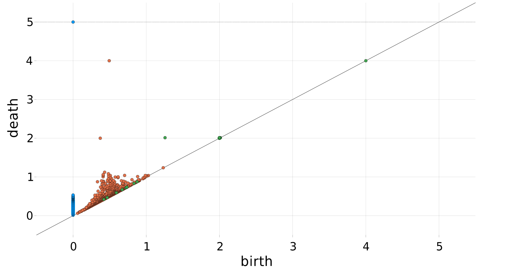
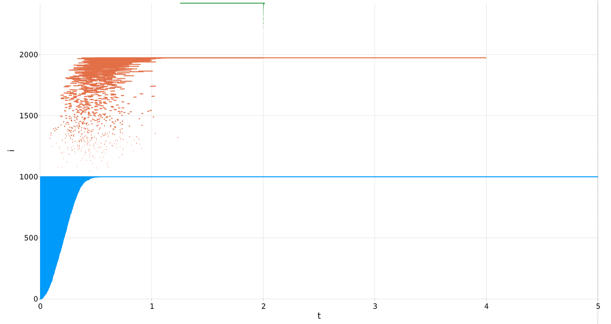
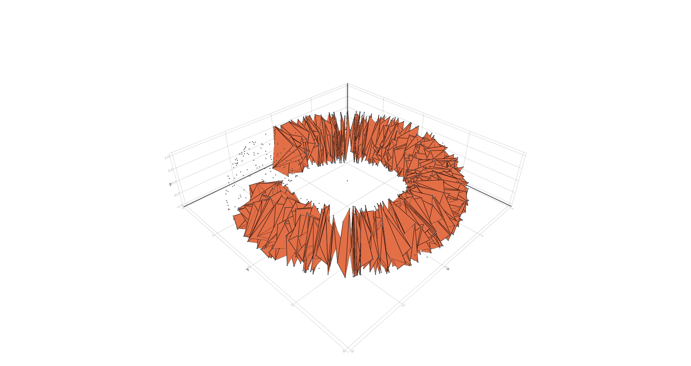

# MakieRipserer.jl

Experimental [Makie](https://github.com/JuliaPlots/Makie.jl) support for
[Ripserer.jl](https://github.com/mtsch/Ripserer.jl/).

## API

```
plot(diagrams; kwargs...)
plot_barcode(diagrams; kwargs...)
```

Plot `PersistenceDiagram` or a collection of them as diagram or barcode.

### Keyword args:

* `infinity`: set the position of infinity line.
* `palette`: set a palette from
  [PlotUtils.jl](https://github.com/JuliaPlots/PlotUtils.jl). Defaults to `:default`.
* `time::Observable`: optional. Display current time on plot.

### Examples




```
plot(simplices, points; kwargs...)
```

Plot simplices over points. `simplices` can be an `AbstractSimplex`, a collection of
simplices or `AbstractChainElement`s or `RepresentativeInterval`.

### Keyword args:

* `pointcolor`, `edgecolor`, `trianglecolor`: set colors of drawn simplices. Can be an
  `Integer` (position in palette) or color.
* `palette`: set a palette from
  [PlotUtils.jl](https://github.com/JuliaPlots/PlotUtils.jl). Defaults to `:default`.
* `shading`: defaults to `false`.
* `transparency`: defaults to `true`.

### Example



```
plot(::AbstractRipsFiltration, points; time, kwargs...)
```

Plot the triangles and edges of Rips filtration at `time` over points.

### Keyword args:

* `pointcolor`, `edgecolor`, `trianglecolor`: set colors of drawn simplices. Can be an
  `Integer` (position in palette) or color.
* `palette`: set a palette from
  [PlotUtils.jl](https://github.com/JuliaPlots/PlotUtils.jl). Defaults to `:default`.
* `shading`: defaults to `false`.
* `transparency`: defaults to `false`.
* `markersize`: defaults to 1.
* `linewidth`: defaults to 1.
* `time`: an observable that controls the time at which to show the filtration.

Warning: Filtrations, particularly `Rips`, can be very large.

```
MakieRipserer.app(points, filtration=Alpha(points))
```

View filtration, diagram, and barcode in interactive app.

### Examples


